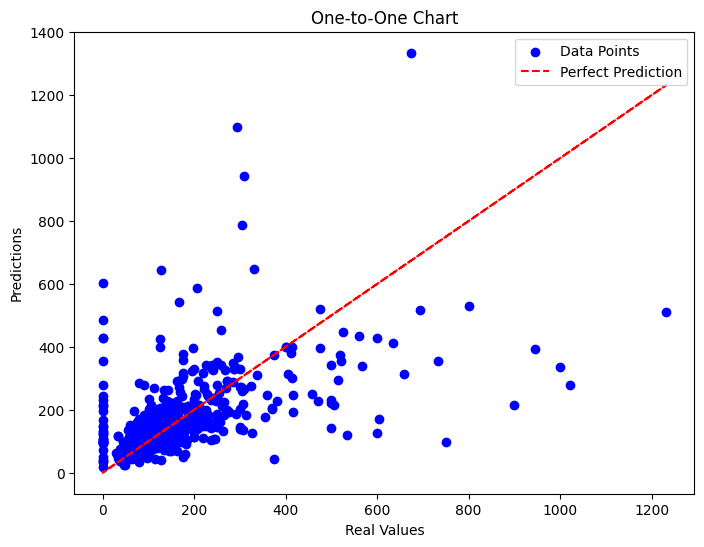
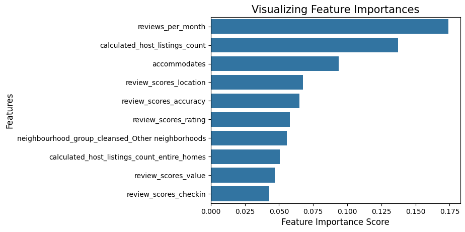
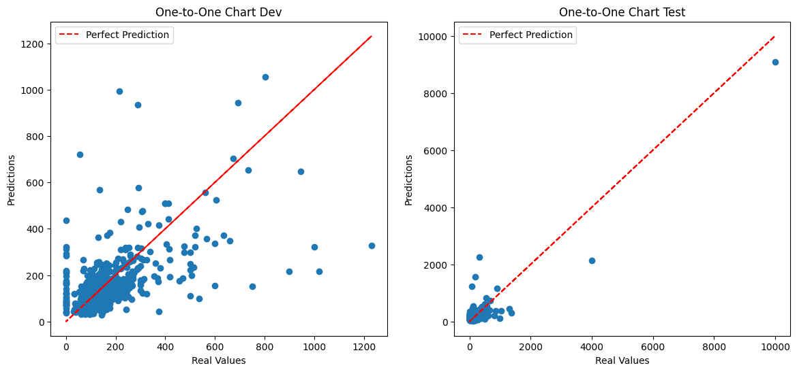

# Airbnb Price Prediction
**Authors:** Martin Ringman, Nate Fortner, Joe Hainje

## Preface
This project analyzes Airbnb listings in Seattle to predict nightly prices using machine learning. The code is written in Python 3.8 and uses libraries such as pandas, scikit-learn, matplotlib, tqdm, nltk, and seaborn. For best reproducibility, we recommend using a virtual environment (e.g., Miniconda), but use any Python environment you prefer.

## Running the Project
1. **Set up a Python 3.8 environment**  
   (Recommended: [Miniconda](https://docs.conda.io/en/latest/miniconda.html))
   ```sh
   conda create -n airbnb-pred python=3.8
   conda activate airbnb-pred
   ```

2. **Install dependencies**
   ```sh
   pip install pandas numpy matplotlib tqdm scikit-learn nltk seaborn
   ```

3. **Download NLTK data**
   The notebook will attempt to download the VADER lexicon automatically, but you can also run:
   ```python
   import nltk
   nltk.download('vader_lexicon')
   ```

4. **Run the analysis**
   Open `airbnb.ipynb` in Jupyter Notebook or VS Code and you're ready to play around.

## Analysis Overview
...existing analysis content...

## Overview
This project explores the relationship between Airbnb listing features and nightly prices. The goal was to build a model that predicts the price of a listing based on its characteristics—such as bedrooms, bathrooms, location, and other relevant details. Data was sourced from [Inside Airbnb](http://insideairbnb.com), focusing on Seattle, Washington for its diverse and active Airbnb market.

## Data Selection & Preparation
After reviewing available datasets, the larger file was selected for its breadth of features (around 70–80 columns). This allowed for a more nuanced analysis, incorporating property characteristics, host information, reviews, and listing types. Irrelevant columns (such as URLs and profile pictures) were removed, leaving data on neighborhoods, reviews, host details, and property attributes.

## Modeling Approach
Several regression models were tested, including Linear Regression, Lasso, and Gradient Boosting. Ultimately, two models stood out:

- **Random Forest Regressor:** An ensemble method that builds multiple decision trees and averages their predictions. After tuning and averaging results, the Random Forest Regressor achieved a stable R² score of around 0.50.
- **MLP Regressor:** Scikit-learn’s implementation of a neural network, which achieved R² scores around 0.46. While both models were useful, most analysis focused on the Random Forest Regressor.

## Results
Using the Random Forest Regressor, we achieved an R² score of 0.3 on the development set and 0.6 on the test set.



The model predicted lower-priced Airbnbs accurately, but struggled with higher-priced properties—likely due to their scarcity in the dataset. Attempts to oversample these listings did not improve accuracy.

Feature importance analysis revealed that review metrics and host listing counts were among the most influential factors in price prediction.



The MLP Regressor produced an R² score of 0.26 on the development set and 0.84 on the test set. The discrepancy may be due to oversampling of lower-priced listings.



## Discussion & Next Steps
While both models predicted Airbnb prices fairly well, this was largely due to most listings falling in the $100–$200 range. Despite the extensive dataset, some important features were missing—such as proximity to attractions, amenities like pools or hot tubs, and more granular location data. Including these could further improve model accuracy.

Future work could extend this analysis to predict booking frequency or occupancy rates, offering valuable insights for prospective hosts. With a more complete dataset, these models could become powerful tools for pricing and market analysis in the Airbnb ecosystem.

## Contact
For questions or collaboration, feel free to reach
